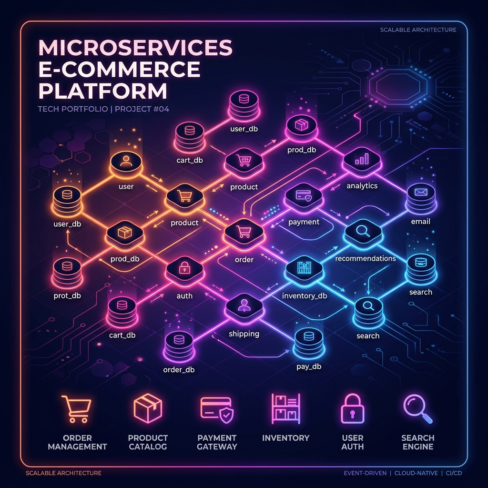

<div align="center">
  
  
  <h1>🛍️ Enterprise E-Commerce Microservices Platform</h1>

  <p>
    A production-ready, enterprise-grade E-Commerce platform built from scratch utilizing a highly scalable, resilient <b>Microservices Architecture</b>.
  </p>

<!-- Badges -->
<p>
  <a href="https://openjdk.org/projects/jdk17/"></a>
  <a href="https://spring.io/projects/spring-boot"></a>
  <a href="https://spring.io/projects/spring-cloud"></a>
  <br />
  <a href="https://kafka.apache.org/"></a>
  <a href="https://www.postgresql.org/"></a>
  <a href="https://www.mongodb.com/"></a>
  <a href="https://redis.io/"></a>
  <a href="https://www.docker.com/"></a>
  
</p>

</div>

---

## 📑 Table of Contents
- [Architecture & Workflow](#-architecture--workflow)
- [Key Features](#-key-features)
- [Codebase Structure](#-codebase-structure)
- [Technology Stack](#-technology-stack)
- [Getting Started](#-getting-started)
  - [Docker Compose (Recommended)](#-option-a-running-with-docker-compose-recommended)
  - [Local Setup](#-option-b-running-locally-for-active-development)
- [API Reference Directory](#-api-reference-directory)
- [Event-Driven Architecture](#-asynchronous-event-driven-architecture)
- [Testing & QA](#-testing-suite--quality-assurance)
- [FAQ & Troubleshooting](#-faq--troubleshooting)

---

## 🏗️ Architecture & Workflow

This repository features service-discovery, API gateway-level security, role-based access control (RBAC), database connection pooling, distributed caching, async event-driven messaging, and comprehensive containerization.

### Logical Workflow Diagram

```text
                       [ CLIENTS (Postman / Browser) ]
                                      |
                                      v (Port 8080)
                       +-------------------------------+
                       |          API GATEWAY          |  <--- (JWT Verification / Rate Limiting)
                       +-------------------------------+
                                 /    |    \
          +---------------------+     |     +-------------------------+
          | (Load Balancing)          |                               |
          v                           v                               v
   +--------------+            +--------------+                +--------------+
   | USER-SERVICE |            | PROD-SERVICE |                | ORDER-SERVICE|
   | (Port 8081)  |            | (Port 8082)  |                | (Port 8083)  |
   +--------------+            +--------------+                +--------------+
          |                           |                               |
          | (JPA)                     | (JPA + Redis Cache)           | (JPA + OpenFeign Sync Client)
          v                           v                               v
    [ postgres_user ]           [ postgres_prod ]               [ postgres_order ]
      (Port 5433)                 (Port 5434)                     (Port 5435)
                                                                      |
                                                                      | (Async Kafka Event)
                                                                      v
                                                             [ KAFKA BROKER (9092) ]
                                                                      |
                                                                      v (Kafka Listener)
                                                             +------------------+
                                                             |   NOTIF-SERVICE  |
                                                             |    (Port 8084)   |
                                                             +------------------+
                                                                      |
                                                                      v (MongoDB)
                                                                [ mongo_notif ]
                                                                  (Port 27017)
```

---

## 🌟 Key Features

### 🛡️ 1. Identity & Security (User Service)
*   **Stateless Session Authentication**: Uses secure JSON Web Tokens (JWT) for user verification and auth flow.
*   **Token Rotation Strategy**: Implements double-token patterns (short-lived Access Tokens, long-lived Refresh Tokens).
*   **Role-Based Access Control (RBAC)**: Fine-grained authorizations protecting admin endpoints (e.g., product creation, order status management).
*   **Blacklist / Revocation Flow**: Secure logout invalidates refresh tokens and session histories.

### 📦 2. Scalable Product Catalog & Caching (Product Service)
*   **High Performance Cataloging**: Categories and products are fully paginated, sorted, and filtered on demand.
*   **Redis Caching Layers**: Reduces database hits by caching hot categories (TTL: 10 mins) and product catalog listings (TTL: 30 mins) with automatic cache eviction on product updates.
*   **Soft Deletes**: Ensures data integrity by marking items as inactive rather than deleting records permanently.

### 💳 3. ACID Transactions & Sync Integrations (Order Service)
*   **Synchronous Stock Checks**: Uses Declarative Spring Cloud OpenFeign client to communicate with `Product Service` during checkout, verifying stock and reducing quantities in a single transaction.
*   **Price Snapshotting**: Freezes product pricing details at the moment of checkout, ensuring historical order data remains intact when product listing prices change.
*   **Order Resiliency**: Implements rollbacks and stock recovery when orders are cancelled.

### 🔔 4. Event-Driven Asynchronous Messages (Notification Service)
*   **Kafka Messaging Backbone**: Decoupled notification processing using Apache Kafka topics.
*   **MongoDB Registry**: Preserves notification history, tracking order creation, updates, and cancellations asynchronously without impacting main checkout latency.

### 🔀 5. Enterprise Infrastructure & Orchestration
*   **Netflix Eureka Discovery**: High-availability service registration registry to make microservices location-transparent.
*   **Spring Cloud API Gateway**: Central entryway handles cross-cutting concerns: gateway routing, CORS headers, security verification, and Redis-backed rate limiting.
*   **HikariCP Database Connection Pool**: Tuned connection properties for fast PostgreSQL execution.
*   **Dockerization & Dependency Health Checks**: All databases and microservices are containerized. Docker compose starts services in a strictly healthy order using container health checks.

---

## 📂 Codebase Structure

```text
ecommerce-microservices/
├── api-gateway/            # 🌐 Gateway routing & JWT security verification
├── discovery-server/       # 📡 Eureka Discovery Server registry
├── user-service/           # 👤 User administration, authentication, and JWT lifecycle
├── product-service/        # 📦 Product inventory catalog & Redis cache management
├── order-service/          # 🛒 Order placement, price snapshotting & Feign clients
├── notification-service/   # 🔔 Async Kafka consumer & MongoDB notification logs
├── docker-compose.yml      # 🐳 Complete infrastructure configuration
├── .env.example            # ⚙️ Configuration variables template
└── README.md               # 📖 Documentation
```

---

## 🛠️ Technology Stack

| Layer | Technology | Description / Version |
| :--- | :--- | :--- |
| **Core** | Java 17, Spring Boot 3.2.x | High-performance backend framework |
| **Infrastructure** | Spring Cloud (Eureka, Gateway) | Service discovery and API routing |
| **Messaging** | Apache Kafka 3.x | Scalable event-driven messaging |
| **Data Persistence** | PostgreSQL 15, MongoDB 6.0 | Polyglot persistence (Relational & NoSQL) |
| **Caching** | Redis 7.x | High-speed distributed caching |
| **Security** | Spring Security, JWT | Stateless token-based security |
| **DevOps** | Docker, Docker Compose | Containerization and orchestration |
| **Tooling** | Maven, OpenAPI 3 (Swagger) | Build automation and API documentation |

---

## 🚀 Getting Started

### 📋 Prerequisites
Ensure the following tools are set up on your machine:
*   [Java 17 JDK](https://openjdk.org/projects/jdk17/) installed and on system path
*   [Apache Maven 3.8+](https://maven.apache.org/)
*   [Docker & Docker Desktop](https://www.docker.com/products/docker-desktop/) (running)

---

### 🐳 Option A: Running with Docker Compose (Recommended)

Docker Compose initializes all service dependencies (PostgreSQL, Redis, MongoDB, Kafka, Zookeeper) and microservices in a single command.

#### 1. Configure the Environment
Copy the example environment template to create your `.env` file:
```bash
cp .env.example .env
```

> [!NOTE]
> Open the `.env` file and customize the database passwords, JWT secrets, and ports if required. The defaults are ready to run out of the box.

#### 2. Start the Microservices
Build and run the entire stack in detached mode:
```bash
docker compose up -d --build
```

#### 3. Monitor Health Check Progress
The containers utilize Docker health checks to boot up in the correct order. You can verify that all instances are fully healthy:
```bash
docker compose ps
```

To view logs for all services or a specific container:
```bash
docker compose logs -f
# Or view a specific container
docker compose logs -f api-gateway
```

#### 4. Stop the Environment
To tear down the containers and preserve persistent database volumes:
```bash
docker compose down
```

---

### 💻 Option B: Running Locally (For Active Development)

If you prefer to run the microservices locally to debug in your IDE:

1. **Spin Up Infrastructure:** Use Docker Compose to run only the databases, cache, and messaging queue:
   ```bash
   docker compose up -d postgres-user postgres-product postgres-order mongodb redis zookeeper kafka
   ```
2. **Configure Environment:** In your `.env`, use `localhost` instead of container names (e.g., `redis` -> `localhost`, `kafka` -> `localhost`).
3. **Build Core Services:**
   ```bash
   mvn clean install -DskipTests
   ```
4. **Start Services in Order:**
   ```bash
   # In separate terminals:
   cd discovery-server && mvn spring-boot:run
   cd api-gateway && mvn spring-boot:run
   cd user-service && mvn spring-boot:run
   cd product-service && mvn spring-boot:run
   cd order-service && mvn spring-boot:run
   cd notification-service && mvn spring-boot:run
   ```

---

## 📡 API Reference Directory

All microservice APIs are routed through the **API Gateway** on Port `8080`.

<details>
<summary><b>🔑 Authentication & User Management Service</b> <i>(Port 8081 via Gateway 8080)</i></summary>

| Method | Endpoint | Auth | Roles | Description |
| :--- | :--- | :--- | :--- | :--- |
| `POST` | `/api/v1/auth/register` | Public | All | Register a new user account. |
| `POST` | `/api/v1/auth/login` | Public | All | Log in to receive Access Token & Refresh Token. |
| `POST` | `/api/v1/auth/refresh-token` | Public | All | Exchange refresh token for a new access token. |
| `POST` | `/api/v1/auth/logout` | Secure | All | Revokes active refresh token and logs user out. |
| `GET` | `/api/v1/users/profile` | Secure | USER, ADMIN | Retrieve active profile details. |
| `PUT` | `/api/v1/users/profile` | Secure | USER, ADMIN | Edit profile information. |
| `GET` | `/api/v1/users` | Secure | ADMIN | Retrieve a paginated list of all users. |
| `DELETE` | `/api/v1/users/{id}` | Secure | ADMIN | Remove user profile by ID. |

</details>

<details>
<summary><b>🛍️ Product Catalog & Inventory Service</b> <i>(Port 8082 via Gateway 8080)</i></summary>

| Method | Endpoint | Auth | Roles | Description |
| :--- | :--- | :--- | :--- | :--- |
| `GET` | `/api/v1/products` | Public | All | Get active products (paginated, sorted, filtered by category). |
| `GET` | `/api/v1/products/{id}` | Public | All | Retrieve specific product details by ID. |
| `POST` | `/api/v1/products` | Secure | ADMIN | Create a new catalog product. |
| `PUT` | `/api/v1/products/{id}` | Secure | ADMIN | Update product details. |
| `DELETE` | `/api/v1/products/{id}` | Secure | ADMIN | Soft delete product from search catalog. |
| `GET` | `/api/v1/categories` | Public | All | Retrieve product categories. |
| `POST` | `/api/v1/categories` | Secure | ADMIN | Register a new product category. |

</details>

<details>
<summary><b>💳 Order Transaction Service</b> <i>(Port 8083 via Gateway 8080)</i></summary>

| Method | Endpoint | Auth | Roles | Description |
| :--- | :--- | :--- | :--- | :--- |
| `POST` | `/api/v1/orders` | Secure | USER, ADMIN | Place a new order (verifies stock & triggers checkout). |
| `GET` | `/api/v1/orders` | Secure | USER, ADMIN | View order history for logged-in user. |
| `GET` | `/api/v1/orders/{id}` | Secure | USER, ADMIN | View order details and statuses. |
| `DELETE` | `/api/v1/orders/{id}` | Secure | USER, ADMIN | Cancel an order (restores inventory & publishes event). |
| `PUT` | `/api/v1/orders/{id}/status` | Secure | ADMIN | Update status (`PENDING`, `CONFIRMED`, `SHIPPED`, etc.). |
| `GET` | `/api/v1/orders/admin/all` | Secure | ADMIN | Retrieve all system orders (paginated). |

</details>

<details>
<summary><b>🔔 Notification Service</b> <i>(Port 8084 via Gateway 8080)</i></summary>

| Method | Endpoint | Auth | Roles | Description |
| :--- | :--- | :--- | :--- | :--- |
| `GET` | `/api/v1/notifications/my` | Secure | USER, ADMIN | Fetch database logs of notifications sent to the user. |

</details>

---

## ⚡ Asynchronous Event-Driven Architecture

The system uses event queues to pass orders and system changes asynchronously. The following JSON schemas are used across Kafka topics:

### Topic: `order.created`
Fired immediately upon checkout. Consumed by `Notification Service`.
```json
{
  "orderId": "5fa23d11-5465-4700-9831-cd9a77ef1c08",
  "userId": "1b988f0a-3cc9-482a-bc91-236b325201fa",
  "userEmail": "customer@example.com",
  "items": [
    {
      "productId": "88aa90be-e04f-4aef-bbdf-1123490bcf88",
      "productName": "Ultra-Wide Gaming Monitor",
      "unitPrice": 499.99,
      "quantity": 1
    }
  ],
  "totalAmount": 499.99,
  "createdAt": "2026-06-03T23:40:00"
}
```

---

## 🧪 Testing Suite & Quality Assurance

The codebase includes integration tests that verify database operations and communications.

To run the verification suite across the entire project:
```bash
mvn clean test
```

### Key Test Coverage Highlights:
*   **User Service**: Checks hashing algorithms, validation tokens, authentication, session blacklisting, and profile management.
*   **Product Service**: Verifies Redis caching operations, data retrieval speeds, serialization, and catalog filtering logic.
*   **Order Service**: Validates OpenFeign communication, transactional integrity, and product inventory updates.

---

## ❓ FAQ & Troubleshooting

> **1. Why are my services failing to start when running `docker compose up`?**
> Verify that no other processes on your host system are using the required ports (e.g. Postgres on `5433`/`5434`/`5435`, Redis on `6379`, Mongo on `27017`, or Gateway on `8080`).

> **2. How long does Eureka take to register the microservices?**
> After the microservices start, they can take up to 30 seconds to appear on Eureka dashboard (`http://localhost:8761`). If you try to route requests through API Gateway too early, you might receive `503 Service Unavailable`.

> **3. How do I test the APIs?**
> Import the provided Postman collection file `ecommerce_microservices.postman_collection.json` into Postman. It contains pre-configured requests for register, login, profile updates, product creation, order checks, and cancellation flows.

---

<div align="center">
  <h3>🤝 Open to Freelance & Full-Time Opportunities</h3>
  <p>Looking for a skilled <b>Backend Developer (Java, Spring Boot, Microservices)</b> for your project?<br/> <i>Let's build something amazing together!</i></p>
  
  <a href="https://github.com/rimjhimkrishna">
    
  </a>
  <a href="#">
    
  </a>
</div>

<br/>

<div align="center">
  <b>Developed by</b> <a href="https://github.com/rimjhimkrishna">Rimjhim Krishna</a><br/>
  <i>If you find this project useful, please consider giving it a ⭐!</i>
</div>
